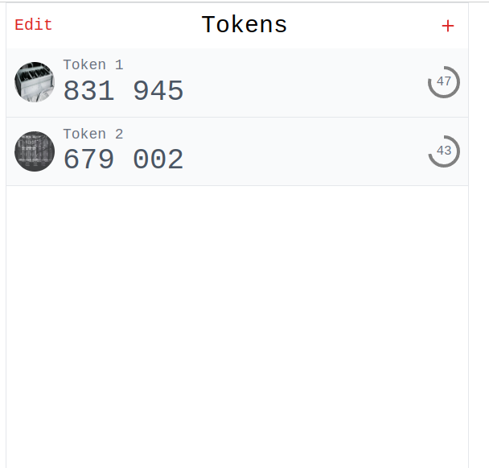
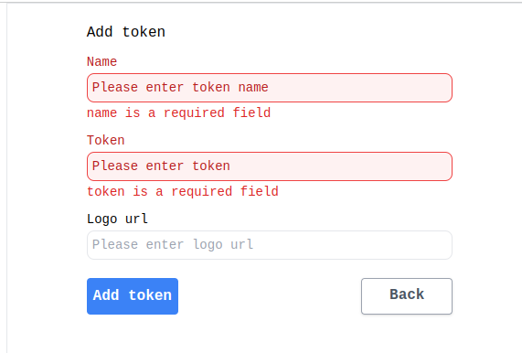

# Tech assessment to evaluate Front End
Application with React + Mobx (Typescript)
## Usage

Client app can use at port: 3000
## How to run in development
Please follow these steps
```bash
git clone https://github.com/thanhndbkhn/authenticator.git]
cd authenticator
```
```bash
npm install
npm run start
```
access: http://localhost:3000

## How to run test Front-end
```bash
npm test
```

## Note
You can change ```durationTimeLeft``` in ```src/shared/mfa.mock.ts``` to setting timeout for a token



You can add new token with name, token number seccet (equal 6 digits) and without logo url (will be set default)



## Learn More
You can learn more in the [Create React App documentation](https://facebook.github.io/create-react-app/docs/getting-started).

Mobx with React: https://mobx.js.org/react-integration.html 

